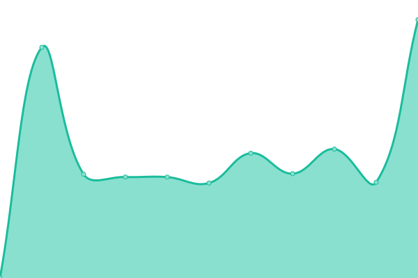
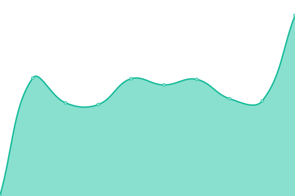

# [📈 Live Status](https://Jordan-Afonso-OCC.github.io/status-page): <!--live status--> **🟩 All systems operational**

This repository contains the open-source uptime monitor and status page for [Jordan-Afonso-OCC](https://Jordan-Afonso-OCC.github.io/status-page), powered by [Upptime](https://github.com/upptime/upptime).

With [Upptime](https://upptime.js.org), you can get your own unlimited and free uptime monitor and status page, powered entirely by a GitHub repository. We use [Issues](https://github.com/Jordan-Afonso-OCC/status-page/issues) as incident reports, [Actions](https://github.com/Jordan-Afonso-OCC/status-page/actions) as uptime monitors, and [Pages](https://Jordan-Afonso-OCC.github.io/status-page) for the status page.

<!--start: status pages-->
<!-- This summary is generated by Upptime (https://github.com/upptime/upptime) -->
<!-- Do not edit this manually, your changes will be overwritten -->
<!-- prettier-ignore -->
| URL | Status | History | Response Time | Uptime |
| --- | ------ | ------- | ------------- | ------ |
|  CCAPI Get customer by MDM_ID | 🟩 Up | [ccapi-get-customer-by-mdm-id.yml](https://github.com/Jordan-Afonso-OCC/status-page/commits/HEAD/history/ccapi-get-customer-by-mdm-id.yml) | 

 1799ms
     
 | 

<a href="https://Jordan-Afonso-OCC.github.io/status-page/history/ccapi-get-customer-by-mdm-id">83.15%</a>
    

|  CCAPI Get customer by email | 🟩 Up | [ccapi-get-customer-by-email.yml](https://github.com/Jordan-Afonso-OCC/status-page/commits/HEAD/history/ccapi-get-customer-by-email.yml) | 

 415ms
     
 | 

<a href="https://Jordan-Afonso-OCC.github.io/status-page/history/ccapi-get-customer-by-email">83.17%</a>
    

<!--end: status pages-->

[**Visit our status website →**](https://Jordan-Afonso-OCC.github.io/status-page)

## 📄 License

- Powered by: [Upptime](https://github.com/upptime/upptime)
- Code: [MIT](./LICENSE) © [Jordan-Afonso-OCC](https://Jordan-Afonso-OCC.github.io/status-page)
- Data in the `./history` directory: [Open Database License](https://opendatacommons.org/licenses/odbl/1-0/)
